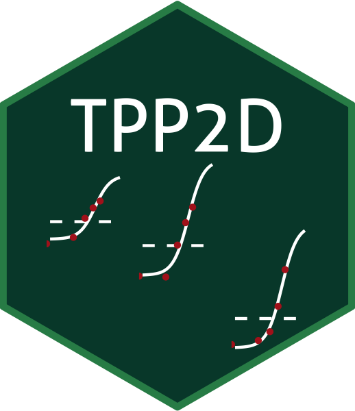

# TPP2D

[](https://codecov.io/gh/nkurzaw/TPP2D)


> Detection of ligand-protein interactions from thermal proteome profiles (DLPTP) by FDR-controlled analysis of 2D-TPP experiments

This package contains functions to analyze 2D-thermal proteome profiles using the DLPTP (detection of ligand-protein interactions from thermal proteome profiles) approach. This is done by fitting two nested models (null and alternative) to the thermal profile of each protein and asking whether the alternative model explains the variance in the data significantly better than the null.



## Installation

### Installation from Bioconductor (recommended)

The `TPP2D` package has been accepted into Bioconductor! Therefore, the most reliable way to install it is via BiocManager:

```{R}
if (!requireNamespace("BiocManager", quietly = TRUE))
install.packages("BiocManager")
BiocManager::install("TPP2D")
```

### Installation of the development version

```{R}
BiocManager::install(“nkurzaw/TPP2D”)
```

## Getting started

The easiest way of learning how to use the `TPP2D` package is to browse it's vignette:
```{R}
library(TPP2D)
browseVignettes("TPP2D")
```
