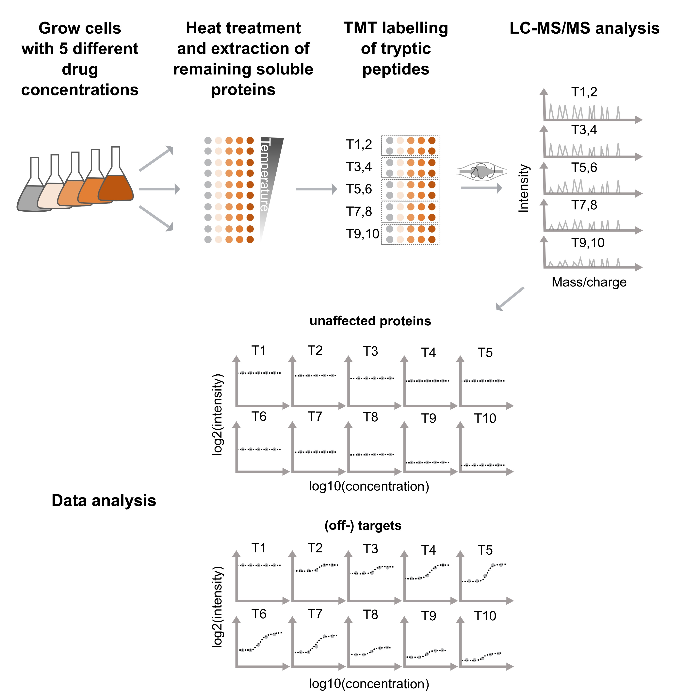

```{r setup, include=FALSE}
knitr::opts_chunk$set(echo = TRUE)
```

# Abstract
Thermal proteome profiling (TPP) [@Savitski2014; @Franken2015] is an unbiased 
mass spectrometry-based method to assess protein-ligand interactions. It works 
by employing the cellular thermal shift assay (CETSA) [@Molina2013] on a 
proteome-wide scale which in brief monitors the profiles of proteins in cells 
over a temperature gradient and tries to detect shifts induced by ligand-protein 
interactions in a treatment versus a control sample. 2D-TPP represents a refined 
version of the assay [@Becher2016] which uses a concentration gradient of the 
ligand of interest over a temperature gradient. This package aims to analyze 
data retrieved from 2D-TPP experiments by a functional analysis approach.

# General information

This package aims at providing an analysis tool for datasets obtained with the 
2D-TPP assay. Please note that methods for analyzing convential TPP datasets 
(e.g. single dose, melting curve approach) can be found at: 
https://bioconductor.org/packages/release/bioc/html/TPP.html and https://git.embl.de/childs/TPP-data-analysis/blob/master/NPARC_paper/reports/NPARC_workflow.Rmd .

This vignette is not aimed to represent an in-depth introduction to thermal 
proteome profiling, please refer to other sources for this purpose:     

- Original TPP paper: http://science.sciencemag.org/content/346/6205/1255784    
- 2D-TPP paper: https://www.nature.com/articles/nchembio.2185   
- review article: https://proteomesci.biomedcentral.com/articles/10.1186/s12953-017-0122-4    

# Installation

1. Download the package from Bioconductor.

```{r getPackage, eval=FALSE}
if (!requireNamespace("BiocManager", quietly = TRUE))
install.packages("BiocManager")
BiocManager::install("TPP2D")
```

Or install the development version of the package from Github.
```{r, eval = FALSE}
BiocManager::install(“nkurzaw/TPP2D”)
```

2. Load the package into R session.
```{r Load, message=FALSE}
library(TPP2D)
```

# Introduction

The 2D-TPP assay is usually set up in a way that for each temperature 5 different 
ligand concentrations (including a vehicle condition) are used and two adjacent 
temperatures each are multiplexed in a single mass spectrometry (MS) run. 
Typically up to 10 or 12 temperatures are used in total that add up to 5 
or 6 MS runs respectively (Figure 1).  
```{r echo=FALSE, fig.cap="Experimental 2D-TPP workflow."}

```
This package aims at providing a tool for finding 'hits' (proteins affected 
in their thermal stability by the treatment used in the experiment) at a given 
false disscovery rate (FDR). Please note that a change in thermal stability 
of a protein is not a guarantee for it interacting with the molecule used as 
treatment. However, we try to give the user additional information by 
specifying whether an observed effect is likely due to stabilization or a 
change in expression or solubility of a given protein to make the 
interpretation of detected hits as easy as possible.

# Step-by-step workflow

```{r, message=FALSE, warning=FALSE}
library(dplyr)
library(TPP2D)
```

After having loaded `dplyr` and the `TPP2D` package itself we start by loading 
an example dataset which is supplied with the package. Therefore, we use 
the `import2dDataset` function.     
For this puporse we need to supply a config table that essentially describes 
which experimental conditions the different TMT labels used correspond to and 
supplies paths to the raw data files (note: since this example dataset is 
included in the package it does not contain a "Path" column, this is however 
mandatory if the data should be read in from external raw files).
```{r}
data("config_tab")
data("raw_dat_list")

config_tab
```


We then call the import function (note: we here supply a list of data frames 
for the "data" argument, replacing the raw data files that would be normally 
specified in the above mentioned column of the config table. If this is 
supplied the argument "data" can simply be ignored):
```{r, warning=FALSE}
import_df <- import2dDataset(
    configTable = config_tab,
    data = raw_dat_list,
    idVar = "protein_id",
    intensityStr = "signal_sum_",
    fcStr = "rel_fc_",
    nonZeroCols = "qusm",
    geneNameVar = "gene_name",
    addCol = NULL,
    qualColName = "qupm",
    naStrs = c("NA", "n/d", "NaN"),
    concFactor = 1e6,
    medianNormalizeFC = TRUE,
    filterContaminants = TRUE)

recomp_sig_df <- recomputeSignalFromRatios(import_df)
```
Please refer to the help page of the function to retrieve in-depth description 
of the different arguments. Essentially the function needs to know the names 
or prefixes of the columns in the raw data files, that contain different 
informations like protein id or the raw or relative signal intensities 
measured for the different TMT labels.    
The imported synthetic dataset consists of 17 simulated protein 2D thermal 
profiles (protein1-17) and 3 spiked-in true positives (tp1-3). It represents 
a data frame with the columns:
```{r, echo=FALSE}
knitr::kable(tibble(
    column = colnames(recomp_sig_df),
    description = 
            c("protein identifier",
            "number of unique quantified peptides",
            "number of unique spectra",
            "gene name",
            "temperature incubated at",
            "experiment identifier",
            "TMT label",
            "RefCol",
            "treatment concentration",
            "raw reporter ion intensity sum",
            paste("raw relative fold change compared to",
                    "vehicle condition at the same temperature"),
            "log10 treatment concentration",
            "median normalized fold change",
            "recomputed reporter ion intensity",
            "recomputed log2 reporter ion intensity"),
    required = 
            c("Yes",
            "No",
            "No",
            "Yes",
            "Yes",
            "No",
            "No",
            "No",
            "No",
            "No",
            "No",
            "Yes",
            "No",
            "No",
            "Yes"))
)
```

Here the column "required" indicates which of these columns is 
neccessary for usage of the downstream functions.    
    
    
We then begin our actual data analysis by fitting two competing models to 
each protein profil: A H0 model that is expected when a protein profile 
remains unaffected by a given treatment and a H1 that fits a contrained 
sigmoidal dose-response model across all temperatures. The goodness of 
fit of both models for each protein is then compared and a $F$ statistic 
is computed.
```{r}
competed_models <- competeModels(
    df = recomp_sig_df)
```

Then we create a null model using our dataset to be able to estimate the 
FDR for a given $F$ statistic in the next step.

```{r}
set.seed(12, kind = "L'Ecuyer-CMRG")
null_model <- bootstrapNull(
    df = recomp_sig_df,
    ncores = 1, B = 2)
```

Please note that setting $B = 2$ (corresponsing to $2$ 
permutations) is not enough to guarantee faithful FDR estimation, this 
has simply been set for fast demonstration purposes. We recommend to 
use at least $B = 20$ for applications in praxis.    
    
To estimate the FDR for all given $F$ statistics and retrieve all 
significant hits at a set FDR $\alpha$ we use the following functions:

```{r, warning=FALSE}
fdr_tab <- computeFdr( 
    df_out = competed_models,
    df_null = null_model)

hits <- findHits(
    fdr_df = fdr_tab,
    alpha = 0.1)

hits %>% 
    dplyr::select(clustername, nObs, F_statistic, fdr)
```

Finally we can fit and plot proteins that have come up as 
significant in our analysis by using:
```{r}
plot2dTppFit(recomp_sig_df, "tp1", model_type = "H0")
```
or respectively for the H1 model:
```{r}
plot2dTppFit(recomp_sig_df, "tp1", model_type = "H1")
```

```{r}
sessionInfo()
```


# References